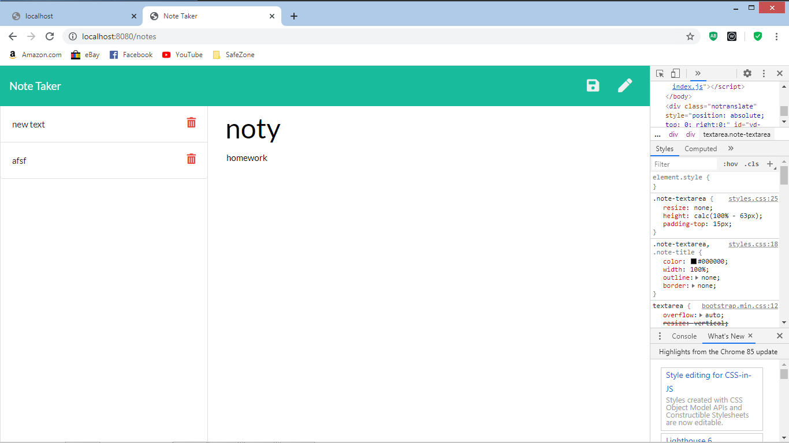

#noty 
noty is a georgia tech assignment given by Georgia Tech BootCamp.
The basic functionalty of the app is should allow the user to make and save todos
for easy reminder
  
known bugs: I was not able to make the delete button work

//code talk server.js file

//line1-6
Are all the inported dependencies

//line 10-13
is called middleware  this allows the app to cross comunicate with the server.

//line14-16
is a get route function to open the local host server
and uses the respond

//line 18-20
is a get rout, routerouted for the app to openthe data from the notes html file
then sends that respond to the the path where the the html file is.

//22-30
is the api route/ function gets and opens the api file read it using fs
with a err data function that retruns data json parse

//line 32-40
is post a post route

[this is the link to the app](https://noty-note.herokuapp.com/)

